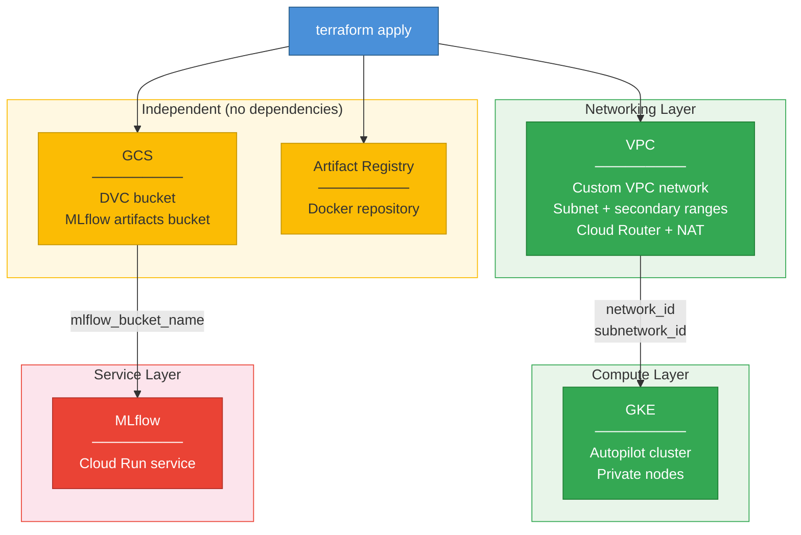

# Terraform Infrastructure Guide

## Infrastructure State Machine



## Architecture Overview

```
infrastructure/terraform/
├── environments/dev/           # Root module (orchestrates everything)
│   ├── main.tf                 # Calls all child modules, wires outputs
│   ├── variables.tf            # Dev-specific variables
│   ├── outputs.tf              # Exposes all outputs for external use
│   └── backend.tf              # State storage configuration
│
└── modules/
    ├── vpc/                    # VPC + subnet with secondary ranges
    ├── gke/                    # GKE Autopilot cluster
    ├── gcs/                    # GCS buckets (DVC + MLflow)
    ├── mlflow/                 # MLflow Cloud Run service
    └── artifact-registry/      # Docker image repository
```

## Key Concepts

### Module Communication

Modules share data via **outputs → variables**:

```hcl
# Root module (environments/dev/main.tf)
module "vpc" { ... }

module "gke" {
  network_id    = module.vpc.network_id      # Output from VPC
  subnetwork_id = module.vpc.subnetwork_id   # becomes input to GKE
}
```

**How it works:**
1. VPC module creates resources, exposes `network_id` as output
2. Root module references it as `module.vpc.network_id`
3. GKE module receives it via its `network_id` variable
4. Terraform builds the dependency graph automatically

### Files Per Module

```
modules/<name>/
├── main.tf      # Resources (the actual infrastructure)
├── variables.tf # Inputs the module accepts
└── outputs.tf   # Values to share with other modules
```

**Convention:** Keep them separate. The GKE module breaks this by putting outputs in `main.tf` (still works, but inconsistent).

## Module Naming Convention

We use two naming patterns:

**Infrastructure Modules** (named after GCP services):
- `gcs`, `gke`, `vpc`, `artifact-registry` — Generic, reusable building blocks

**Application Modules** (named after purpose):
- `mlflow` — Deploys a complete MLflow server (uses Cloud Run + service account + IAM bindings)

The `mlflow` module is named after the application because it packages multiple resources together to deploy MLflow specifically, not just a generic Cloud Run service.

## Common Issues & Fixes

### Error: `labels` not expected

```
Error: An argument named "labels" is not expected here.
```

**Fix:** Use `resource_labels` instead of `labels` for `google_container_cluster`.

```hcl
# Wrong
labels = var.labels

# Right
resource_labels = var.labels
```

### Error: Secondary ranges not found

```
Error: Pod secondary range "pods" not found
```

**Cause:** GKE requires secondary IP ranges ("pods", "services") in the subnet.

**Fix:** Use the VPC module (creates subnet with proper ranges) instead of default network.

## Quick Commands

```bash
# Initialize (after adding new modules)
cd environments/dev && terraform init

# Plan specific modules
terraform plan -target=module.vpc -target=module.gke

# Apply everything
terraform apply

# Get outputs for external tools
terraform output dvc_bucket_name          # For DVC
gcloud container clusters get-credentials $(terraform output -raw gke_cluster_name)  # For kubectl
```

## Using Outside Terraform

```bash
# Configure DVC
dvc remote add -d gcs gs://$(terraform output -raw dvc_bucket_name)

# Configure kubectl
gcloud container clusters get-credentials deepmlhub-cluster --region us-central1

# Push Docker images
gcloud auth configure-docker $(terraform output -raw docker_repository_url)
```

## Deployment Order

Terraform figures this out automatically via dependencies:

1. **VPC** (must exist first)
2. **GKE** (depends on VPC)
3. **GCS** (independent)
4. **Artifact Registry** (independent)
5. **MLflow** (depends on GCS bucket)

## Production Considerations

- **State storage:** Currently local (use GCS backend for team collaboration)
- **Environment separation:** Copy `environments/dev/` to `environments/prod/`
- **Cost:** GKE Autopilot has a ~$70/month control plane cost
- **Security:** Private nodes enabled in GKE, Cloud NAT for outbound access
